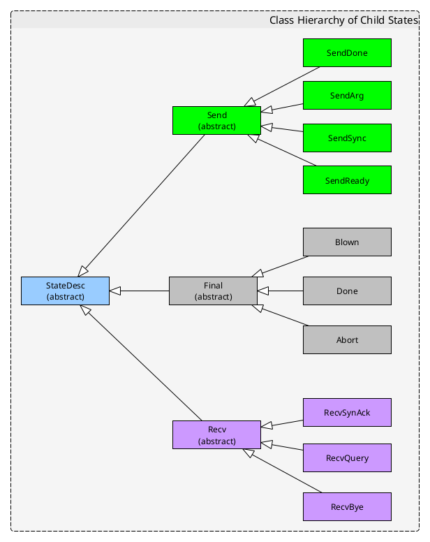
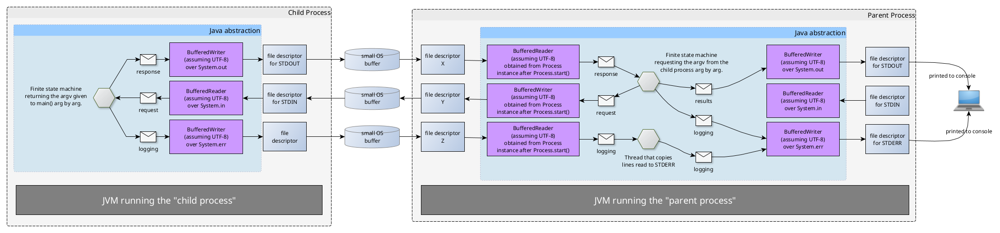
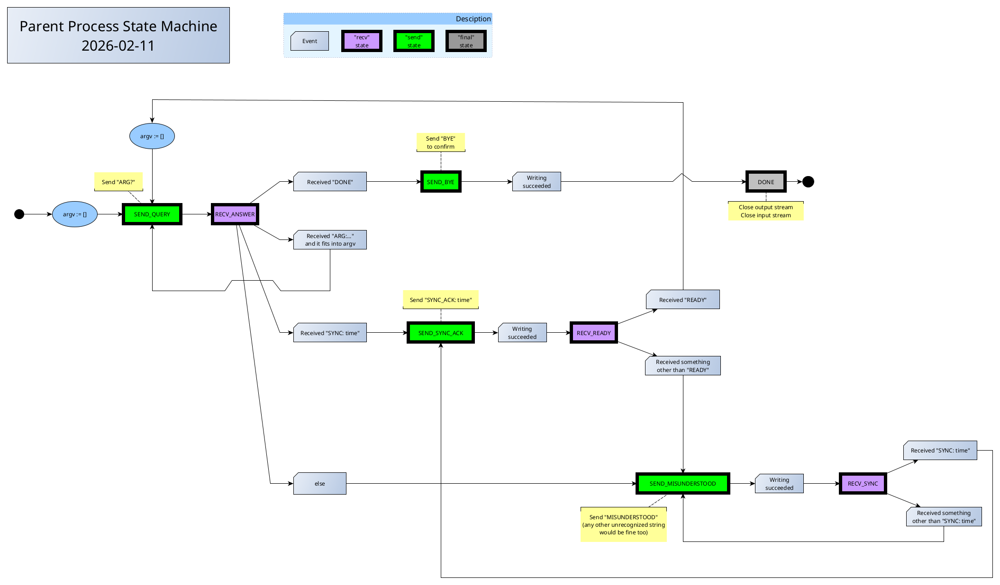
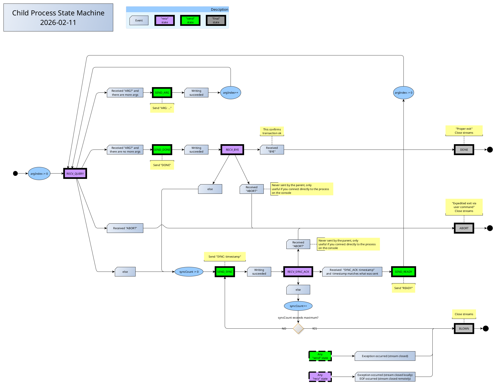

# simple_parent_child_ipc_example

Kotlin code to start a child process, with the parent process then talking with the child via STDIN/STDOUT.

Both child process and parent process are implemented as finite state machines that send one-liners to each other.

The states are instances of a hierarchy of state classes (there is no dedicated enum to list the states).
An instance representing a state exists for a single step and is replaced by a new instance representing the follower state.
The ancillary data (counters, streams and other variant data) that the state machine needs and handles is held in dedicated immutable instances references by the state instances.
If the ancillary data changes (e.g. there is a counter increase), then a fresh anciallary data instance is created and the current one is discarded.
This yields a rather elegant solution, code-wise. 

How to run this:

Compile an uberjar by running the maven target "clean install"

Edit the configuration file, here named "config.txt", indicating the uberjar, the java VM executable (as the POM says to compile to version 21, the java VM must be at least version 21)

```
####
# Configuration that tells the parent process how to start the child process.
# Where this file is (it not being a resource) is communicted to the parent
# process with the --config=<path> option.
####

# The directory in which the child process will be started.

workDir      = /home/someuser

# The uberjar which contains all the code for the child process.
# That uberjar is created with the aven target "clean install"

childJarFile = /home/someuser/parent_child_ipc-1.0.jar

# The Java executable used to run the child process.
# Asuming at least version 21 because that is the target bytecode version
# stipulated in the pom.xml

javaExe      = /usr/local/java/jdk22_64_adopt/bin/java
```

Run the parent process, indicating the config file by giving `--config=path/to/config/file` as option.

The parent process is set up to start the child process with arguments `A`, `B`, `C`. 

You will see the log whereby the parent process asks the child sequentially for its arguments and receives the `A`, `B`, `C` in turn, finally printing the received string vector to STDOUT.

Here is the class hierarchy of the states for the "child process state machine":



Here is the general idea:



Here is the parent state machine:



Here is the child state machine:




