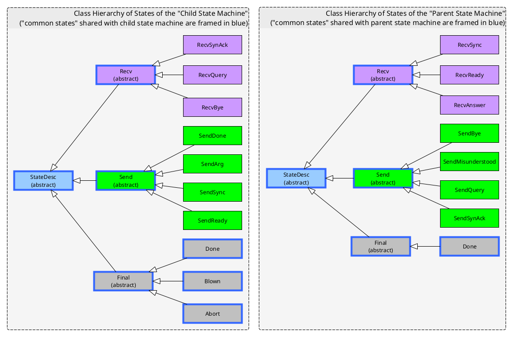

# simple_parent_child_ipc_example

## What is this?

An exercise in Kotlin to have a 'parent process' start a 'child process', with the 'parent process' then talking with the 'child process' via piped STDIN/STDOUT.

Here is the general idea concerning the architecture:


## Features

- Argv (i.e. command-line argument) processing for both parent process and child process is based on explicitly programmed-out finite state machines.
  The alternative would have been to use an third-party library (for example, [picocli](https://picocli.info/)), which would have allowed a more declarative approach.
  However, argv processing is simple enough and Kotlin is expressive enough that we can bake specialized code directly.
- Both parent process and child process behaviour is based on finite state machines that send one-liners to each other over piped STDIN/STDOUT.
  - "States" are instances from a class hierarchy, each non-abstract class in that hierarchy standing for a possible state. The class
    hierarchy allows to factor out common behavior into superclasses, and also to partition the set of states into "final states",
    "states during which the process listens for data on STDIN", "states during which the process listens for data on STDOUT" etc. 
  - An actual instance representing "being in a state at a certain time" exists for a single step of the finite state machine.
    The instance is thrown away and replaced by a fresh instance that represents the follower state whenever, conceptually, "edge traversal" happens.
  - Every "state class" has an `onEntry()` method which is called by the state machine runner (a very small loop of 3 lines) immediately
    after the state instance has been created. Actions that  happen "during that state" (a fuzzy concept, really, as it may not be entirely clear
    when, conceptually, a state "starts" or "ends") are performed in the `onEntry()` method. In particular, receiving a line from STDIN (but blocking
    as long has it hasn't fully arrived), sending a line to STDOUT (but blocking if the output buffer is full) and deciding what shall be the next state
    are all done in `onEntry()`. `onEntry()` simply instantiates and returns the next state instance to the state machine runner. The state machine
    runner will then call `onEntry()` on that instance, and the cycle repeats.
  - Any ancillary data (counters, the reader and write on top of streams, timestampe etc.) that the state machine needs to maintain in addition
    to the central representation of state, is kept in dedicated immutable instances, referenced by state instances. If the ancillary data changes
    (e.g. there is a counter incrementation), then a fresh anciallary data instance based on the existing one is created and passed to the next
    state instance's constructor. This yields a rather elegant solution, code-wise. Previously I was focusing on representing the state as a
    "state variable" that would take on a value from an enum type, and ancillary data as a bunch of variables held by a the class representing
    the state machine. That class also had per-state processing methods. But that yielded a much messier bunch of code.

## The parent state machine


### The child state machine


## The class hierarchy of states



## Notes

- Everything is in the namespace `name.pomelo.parent_child_ipc`

## How to run the program

- Compile an "überjar" by running the maven target "clean install". 
- Edit the configuration file, here named `config.txt` (see below for an example), indicating
   - The "überjar" just created,
   - The Java VM executable (as the POM says to compile to version 21, the java VM must be at least version 21) and
   - The working directory for the child process. That would generally simply be the user's home directory.
- Start the parent process, indicating the following on the command line:
  - The config file by giving option `--config=<path/to/config/file>`,
  - Whether you want or generate random "accidents" (random STDIN/STDOUT closure, unexpected lines) in the child or the parent, with the
    options `--with-child-accidents` and `--with-parent-accidents`.
  - The arguments that the child process shall send to the parent process over piped I/O on request, separated from the other arguments with the double dash `--`.
   
You will see the log (on STDERR) whereby the parent process asks the child sequentially for its arguments, finally printing the received strings to STDOUT.

### Examples

Start the parent-child pair. The strings `A`, `B`, `C` will be communicated to the parent process by the child process:

```
java -jar ~/simple_parent_child_ipc_example/target/parent_child_ipc-1.1.jar --config=~/simple_parent_child_ipc_example/config.txt -- A B C
```

As above, but there will be "accidents" (random STDIN/STDOUT closure, unexpected lines), exercising error-hamndling behaviour:

```
java -jar ~/simple_parent_child_ipc_example/target/parent_child_ipc-1.1.jar --config=~/simple_parent_child_ipc_example/config.txt --with-child-accidents --with-parent-accidents -- A B C
```

You can also run the child in isolation and talk to it directly from the console (playing parent) by passing the argument `--child`. Consult the state machine diagrams to find out how to perform the exchange.

```
java -jar ~/simple_parent_child_ipc_example/target/parent_child_ipc-1.1.jar --config=~/simple_parent_child_ipc_example/config.txt --child -- A B C
```

## An example run

Running the following to set up the parent/child processes, and make the child, in response to a sequence of queries by the parent, respond with values `A`, `B`, `C` in turn, 

```
java -jar ~/simple_parent_child_ipc_example/target/parent_child_ipc-1.1.jar --config=~/simple_parent_child_ipc_example/config.txt -- A B C
```

We see the following in the log:

```
INFO[PARENT]: argvAnalysisResult: withChildAccidents = false, discardedArgv = [], argsBeyondDashDash = [A, B, C]
INFO[PARENT]: Entering state: SendQuery
INFO[PARENT]: SendQuery: sending 'ARG?'
INFO[PARENT]: Parent to child: 'ARG?[0a]'
INFO[PARENT]: Next state will be: RecvAnswer
INFO[PARENT]: Entering state: RecvAnswer
CHILD STDERR: INFO[CHILD]: argvAnalysisResult: withChildAccidents = false, discardedArgv = [], argsBeyondDashDash = [A, B, C]
CHILD STDERR: INFO[CHILD]: Entering state: RecvQuery
CHILD STDERR: INFO[CHILD]: RecvQuery: received 'ARG?'
CHILD STDERR: INFO[CHILD]: Next state will be: SendArg
CHILD STDERR: INFO[CHILD]: Entering state: SendArg
CHILD STDERR: INFO[CHILD]: SendArg: sending 'ARG: 0 = 'A''
CHILD STDERR: INFO[CHILD]: Next state will be: RecvQuery
CHILD STDERR: INFO[CHILD]: Entering state: RecvQuery
INFO[PARENT]: RecvAnswer: received 'ARG: 0 = 'A''
INFO[PARENT]: Next state will be: SendQuery
INFO[PARENT]: Entering state: SendQuery
INFO[PARENT]: SendQuery: sending 'ARG?'
INFO[PARENT]: Parent to child: 'ARG?[0a]'
INFO[PARENT]: Next state will be: RecvAnswer
INFO[PARENT]: Entering state: RecvAnswer
CHILD STDERR: INFO[CHILD]: RecvQuery: received 'ARG?'
CHILD STDERR: INFO[CHILD]: Next state will be: SendArg
CHILD STDERR: INFO[CHILD]: Entering state: SendArg
CHILD STDERR: INFO[CHILD]: SendArg: sending 'ARG: 1 = 'B''
INFO[PARENT]: RecvAnswer: received 'ARG: 1 = 'B''
CHILD STDERR: INFO[CHILD]: Next state will be: RecvQuery
CHILD STDERR: INFO[CHILD]: Entering state: RecvQuery
INFO[PARENT]: Next state will be: SendQuery
INFO[PARENT]: Entering state: SendQuery
INFO[PARENT]: SendQuery: sending 'ARG?'
INFO[PARENT]: Parent to child: 'ARG?[0a]'
INFO[PARENT]: Next state will be: RecvAnswer
INFO[PARENT]: Entering state: RecvAnswer
CHILD STDERR: INFO[CHILD]: RecvQuery: received 'ARG?'
CHILD STDERR: INFO[CHILD]: Next state will be: SendArg
CHILD STDERR: INFO[CHILD]: Entering state: SendArg
CHILD STDERR: INFO[CHILD]: SendArg: sending 'ARG: 2 = 'C''
INFO[PARENT]: RecvAnswer: received 'ARG: 2 = 'C''
CHILD STDERR: INFO[CHILD]: Next state will be: RecvQuery
CHILD STDERR: INFO[CHILD]: Entering state: RecvQuery
INFO[PARENT]: Next state will be: SendQuery
INFO[PARENT]: Entering state: SendQuery
INFO[PARENT]: SendQuery: sending 'ARG?'
INFO[PARENT]: Parent to child: 'ARG?[0a]'
INFO[PARENT]: Next state will be: RecvAnswer
INFO[PARENT]: Entering state: RecvAnswer
CHILD STDERR: INFO[CHILD]: RecvQuery: received 'ARG?'
CHILD STDERR: INFO[CHILD]: Next state will be: SendDone
CHILD STDERR: INFO[CHILD]: Entering state: SendDone
INFO[PARENT]: RecvAnswer: received 'DONE'
CHILD STDERR: INFO[CHILD]: SendDone: sending 'DONE'
INFO[PARENT]: Next state will be: SendBye
CHILD STDERR: INFO[CHILD]: Next state will be: RecvBye
CHILD STDERR: INFO[CHILD]: Entering state: RecvBye
INFO[PARENT]: Entering state: SendBye
INFO[PARENT]: SendBye: sending 'BYE'
INFO[PARENT]: Parent to child: 'BYE[0a]'
CHILD STDERR: INFO[CHILD]: RecvBye: received 'BYE'
INFO[PARENT]: Next state will be: Done
INFO[PARENT]: Final state: Done
CHILD STDERR: INFO[CHILD]: Next state will be: Done
CHILD STDERR: INFO[CHILD]: Final state: Done
INFO: Child process hasn't exited yet - waiting 10 ms.
CHILD STDERR: [[[ CHILD STDERR CLOSED ]]]
Final parent state   : Done
Child exit value     : 0
argv[0] = 'A'
argv[1] = 'B'
argv[2] = 'C'
```

## An example "config file"

The reading functions understand that `$HOME` and `~` stand for the "user home".

```
####
# Configuration that tells the parent process how to start the child process.
# Where this file is (it not being a resource) is communicted to the parent
# process with the --config=<path> option.
#
# The config file reader understands $HOME and ~ as shorthand for the user's home directory.
####

# The directory in which the child process will be started.

workDir = $HOME

# The uberjar which contains all the code for the child process.
# That uberjar is created with the aven target "clean install"

childJarFile = $HOME/simple_parent_child_ipc_example/target/parent_child_ipc-1.1.jar

# The Java executable used to run the child process.
# Asuming at least version 21 because that is the target bytecode version
# stipulated in the pom.xml

javaExe      = /usr/local/java/jdk22_64_adopt/bin/java```
```
